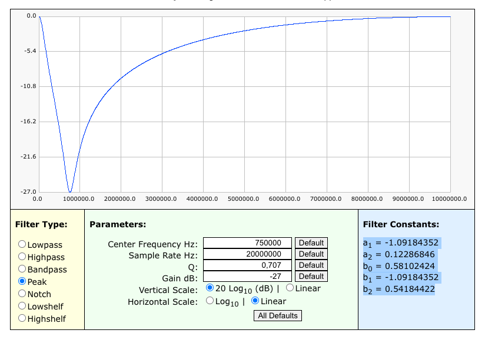
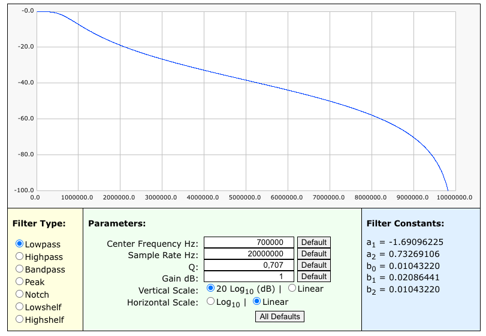
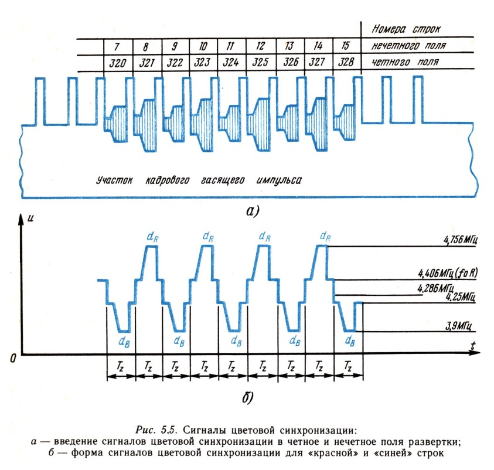
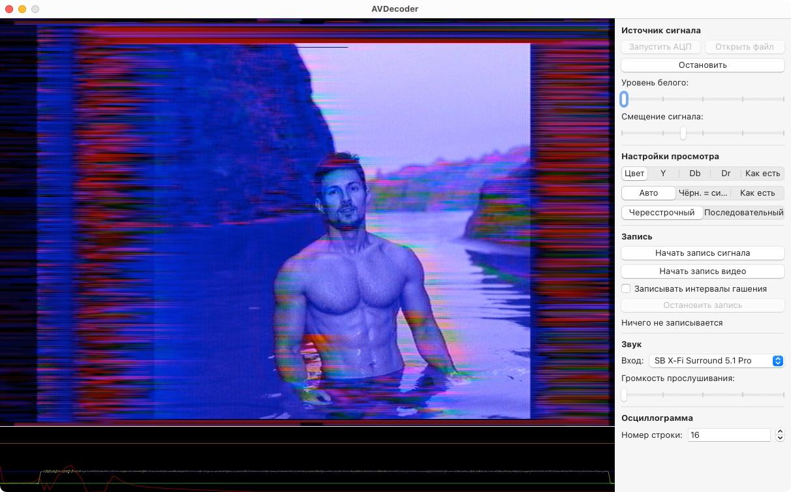

This is a software-defined analog (composite) video decoder aka "why would you buy a capture card if you can build one". It takes a digitized video signal from an ADC, decodes it, and displays it on the screen. It also supports recording and replaying raw signals, as well as recording video files.

Only SECAM is supported (for now?).

## Video samples

[](https://www.youtube.com/watch?v=d2UbD22FDqY)
[](https://www.youtube.com/watch?v=5gTD4yl5t5c)

[More samples in my Telegram channel](https://t.me/grishkoblog/83)

## How it works

### Hardware

This uses an AD9226 ADC board I bought on AliExpress for 1400₽ or about $18, connected to a Raspberry Pi Zero's GPIO pins. The Raspberry Pi acquires the data from the ADC at 20 MS/s using the [SMI peripheral](https://iosoft.blog/2020/07/16/raspberry-pi-smi/) and streams it over USB. SMI wasn't really designed to run continuously, but I managed to work around that by writing `0xffffffff` into the "length" register and setting the "start" bit to 1 every now and then. The data is being read into two 512K buffers using two DMA control blocks arranged in a loop (pointing to each other as the "next" one).

### How the signal decoding is done

There's a lot of information online about *generating* video signals, but surprisingly little about *decoding* one. So I feel obliged to document it since it took me an embarrassing amount of trial and error to figure this out.

First of all, here's what an analog video signal looks like ([source](https://www.batsocks.co.uk/readme/video_timing.htm)) so you have an idea about the following explanations:


The Mac app reads the digitized signal from the RPi in those same 512K chunks that are being read by it from the ADC. 8-bit samples are converted to `float`s of 0.0 - 1.0.

#### Filters

The app uses two types of digital filters: biquadratic (IIR) and FIR. All biquadratic filters were calculated using [this online tool](https://arachnoid.com/BiQuadDesigner/index.html) and all FIR ones using [this one](http://t-filter.engineerjs.com).

The difference between the two types is that IIR filters are very cheap, but introduce different delays to different frequency components in the signal, while FIR filters are expensive (hundreds of multiplications and additions per sample) but provide a fixed delay and don't mess with the phase of your signal.

Apple provides both types (and more) in Accelerate.framework. Those work about 1.5x faster than my naive straightforward implementations.

#### Color subcarrier separation

A *composite* video signal gets its name from having both luminance and chrominance combined. The first step is to separate them back because working with just the luminance makes the next steps perform better.

A FIR filter is used to separate the subcarrier. I don't remember the exact parameters but it passes frequencies in the range of about 3.8 - 4.6 MHz. This results in just the color subcarrier centered around zero, which can then be simply subtracted from the signal to get the luminance.

#### Chrominance demodulation

SECAM uses frequency modulation to encode color. Googling "frequency demodulation in software without I/Q" yields *all kinds* of mathematical formulas and convoluted algorithms like PLL. I decided that I don't want any of that. The most straightforward method of determining the frequency of a sine wave seems to be to count the samples between its zero crossings, so this is what I do. To achieve sub-sample precision, I do linear interpolation in reverse (given the values and X coordinates of two points, find the coordinate where the value of 0 would be between them) to end up with the inverse of the instantaneous frequency. This is then linearly interpolated between zero crossings. This works surprisingly well.

A de-emphasis filter is then applied to the resulting signal to undo the distortions near sharp color transitions introduced by the encoding process:



(obtained by tweaking the parameters until the output looked right, there's no information whatsoever about the parameters of this)

#### Luminance low-pass filtering

Some parts of the next steps operate on a copy of the luminance signal passed through this filter, to reduce the effect of noise:



The three signals (luminance, chrominance, filtered luminance) are always passed around together as a sort of three-channel signal for the rest of the decoding process.

#### Level detection

In the real world, different devices will output a signal at a different voltage offset *and* with a different amplitude. We need to detect these levels to correctly identify sync pulses (see diagram above). Currently, we're only interested in two of them: the "blacker than black" sync pulse level and the black level. It's **very important** to detect these correctly or otherwise the image will be messed up (guess how I know).

The filtered luminance signal is split into 128 equal parts. For each part, the minimum value is found. Then an average of these + 0.1 is taken as the threshold to find the actual sync level, and the average of all samples below that threshold becomes the sync level.

For the black level, it's a variation of the same algorithm: now we average out every 40 samples that come after skipping 15 samples after the threshold of (sync level + 0.08) is crossed upwards. The idea is to sample the "back porch" of each line which is this level.

The threshold for finding the sync pulses is then 25% between the sync level and the black level.

#### Sync pulse detection

The buffer (and one line of the next buffer) is traversed to find sequences of samples that fall below the threshold. Periods longer than 1.75 µs (35 samples) are considered sync pulses and stored for later.

#### Separation into fields

The signal is separated into video fields at long sync pulses. Which field is top and which is bottom is determined by finding the closest previous regular horizontal sync pulse (by length) and looking at the fractional part of how many lines away it is from the long one. The boundaries of the fields are adjusted such that the bottom field includes the first half of the line that contains its first long sync pulse, making the top fields 312 lines and the bottom ones 313.

If there is no long sync pulse for 313 or 312 lines depending on which field was last, the corresponding number of samples is taken as a new field anyway.

Next steps are done on fields.

#### Recalculating levels for each field

Similarly to how it was done for entire buffers, the black and sync levels are recalculated for each field to make it more consistent, except the already found sync pulse locations are used.

#### Separation into lines

Each field is separated into lines at sync pulse locations. Lines that are too long (meaning a pulse was missed somewhere) are split. Lines that are too short are joined.

The field, consisting of the lines, a flag whether it's top or bottom, and sync/black levels, is then put into a queue.

#### Field alternation enforcement

When there are 4 fields in the queue, they are checked if they are all top or bottom. If they are, this means that either the signal is really messed up, or it's progressive scan, the kind that some game consoles output. They are made to alternate top and bottom in this case.

#### White level detection

The default white level is set to `black level + (black level - sync level) * 0.43`. Lines 17 and 330, which, at least on Russian TV broadcasts, often contain a test signal with the white level, are sampled for a "true" white level which might be higher than the default one, by thresholding and averaging. This white level is then used for the entire field.

Next steps are done on lines.

#### Color synchronization

SECAM encodes color as two components, Db and Dr, on alternating lines. A decoder needs to know which line contains which. To help it, lines 7-15 and 320-328 contain these signals:



Some samples are averaged from the beginning and the end of the chrominance signal of each of these lines. If the beginning is within 3.5 - 4.5 MHz, and the end is more than 270 kHz away form that, the sign of that difference is used to set a flag whether the current line is a red or blue one.

#### Chrominance normalization

Since now we know whether the current line is red or blue, the chrominance signal that so far has contained the inverse of the frequency can be processed all the way. This raw frequency value is simply converted to the chrominance by offset and division.

It is then passed through a low-pass filter to remove the noise introduced by the demodulation.

#### Line alignment

The locations of the edges of the two sync pulses surrounding the current line are found with sub-sample precision using the same "inverse interpolation" trick used for demodulation. The luminance and chrominance are then resampled such that these edges are at the same offset in all lines.

#### Pixel rendering

Finally, pixels are written to frame buffers that are drawn on the screen or written to a video file.

## If you want to use it yourself

### Raspberry Pi setup

Connect the ADC board like this:

```
Pi         ADC
GND     -> GND
5V      -> 5V
GPIO 6  -> CLK
GPIO 8  -> D1
GPIO 9  -> D2
GPIO 10 -> D3
GPIO 11 -> D4
GPIO 12 -> D5
GPIO 13 -> D6
GPIO 14 -> D7
GPIO 15 -> D8
```
I only use 8 bits out of 12 and skip the least-significant bit because it's noise anyway.


Flash a Debian Bookworm image to the SD card. Add this to `boot.txt` to enable the USB gadget mode:
```
[all]
dtoverlay=dwc2
```
Place the files `adc_stream.service` and `usb_gadget.service` from `rpi` under `/lib/systemd/system`. Place the executables (`adc_stream` and `usb_init`) and the `usb_gadget` script under `/usr/bin` (or compile them from the included sources), make sure they have the execute bit set. Activate the services:
```
sudo systemctl enable usb_gadget
sudo systemctl enable adc_stream
```
and restart the RPi. Connect it to your Mac using the "USB" (not "PWR") USB port. Connect a composite video source to the ADC.

### Mac setup

Install the FLAC library using Homebrew, this is used to compress the captured raw signals:
```
brew install flac
```
Then open `AVDecoder.xcworkspace` in Xcode, build the app and run it.

The UI is pretty self-explanatory. If you're seeing a distorted picture, adjust the "signal offset". Recordings you make are saved to `~/Movies/AVDecoder`.

## What happens if you put a PAL signal into it?

Here's PAL Durov to satisfy your curiosity:


