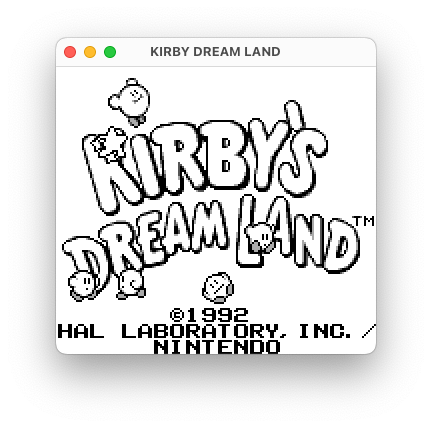
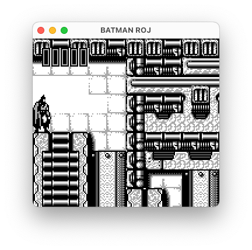
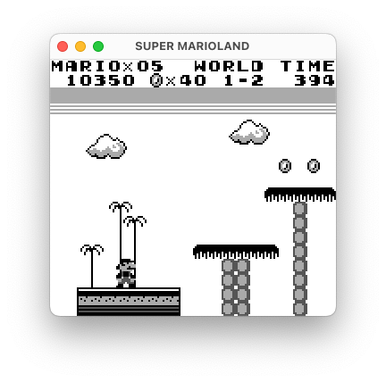
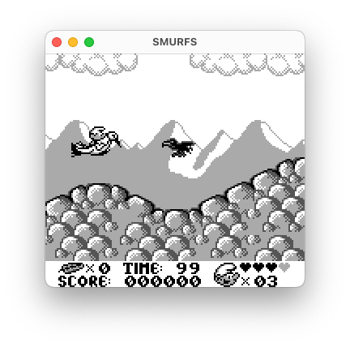

This is a Game Boy emulator I made to educate myself about low-level computer stuff. It should run on pretty much anything that can run modern Java.

Controls: arrow keys, `A` = A button, `S` = B button, `Enter` = start, `Backspace` = select. `Cmd/Ctrl+O` opens a new ROM, `Cmd/Ctrl+R` restarts emulation.

|                       |                        |
|-----------------------|------------------------|
|  |  |
|  |  |

Things to note:
- Only original Game Boy (aka "DMG") for now — color games won't run
- PPU timings aren't most accurate so games and demos that change PPU registers during mode 3 will produce glitches
- CPU instructions have their effects "instantly" as opposed to "properly" doing memory accesses on appropriate clock cycles like real hardware would
- Supported cartridge mappers are MBC1 and MBC5
- Sound *mostly* works
- There's no vsync because Swing sucks
- All my childhood games are playable! Those of them that don't require Game Boy Color, that is. Which is most of them anyway.